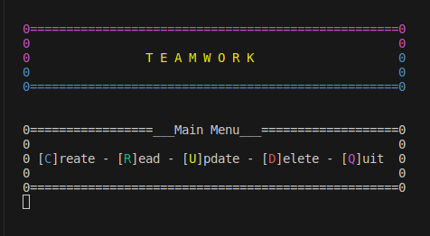

# **My mini program: "Teamwork"**

**What it is about**

This terminal-based mini application simulates a system for managing a number of different tasks (e.g. for working together in a team).
For demonstrational purpose, a small number of tasks is provided upfront. Users can edit or delete existing tasks, create new tasks or sort the tasks by different categories such as priority or date. New tasks are automatically assigned the date of their creation.

**Try it out!**

- After installing all required packages ("npm install"), simply start the app in terminal via node: ("node app").
- Follow the instructions in the terminal.

